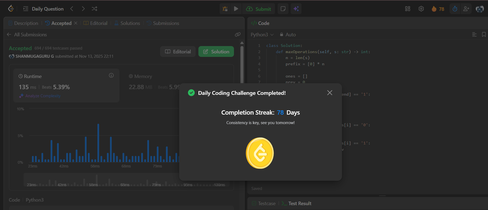

# Day 78 - Maximum Number of Operations to Move Ones to the End

**Problem Link**: [LeetCode 3228 - Maximum Number of Operations to Move Ones to the End](https://leetcode.com/problems/maximum-number-of-operations-to-move-ones-to-the-end/)  
**Difficulty**: Medium

## Approach

We solve this by **iterating from the end** of the string and **counting groups of `1`s** separated by `0`s.

### Key Insight:
> Each `0` allows **all previous `1`s** to move **one step right**.  
> So, every group of `1`s contributes `(number of 1s) × (number of 0s to its right)`.

### Solution:
- Traverse the string **from right to left**.
- Keep track of:
  - `prev`: number of `1`s seen so far (from the right).
  - `ans`: total operations.
- **Skip trailing `1`s** (they're already at the end).
- For each group of `1`s followed by `0`s:
  - Count the `1`s → add `1` to `prev`.
  - For **each `1` in this group**, it can move **once per `0` to its right** → add `prev` to `ans` for each `1`.

> This counts **all valid swaps** where a `1` moves right past a `0`.

### Example: `s = "1001101"`
| Step | `end` | Action | `prev` | `ans` |
|------|-------|--------|--------|-------|
| Start | -1 | Skip trailing `1` | 0 | 0 |
| "01" | -3 | See `1` → `prev=1` | 1 | 0 |
| "10" | -5 | See `1` → add `prev=1` → `ans=1` | 2 | 1 |
| "01" | -7 | See `1` → add `prev=2` → `ans=3` | 3 | 3 |

→ **3 operations**

## Complexity

- **Time**: **O(n)** — single pass
- **Space**: **O(1)**

## Screenshot
