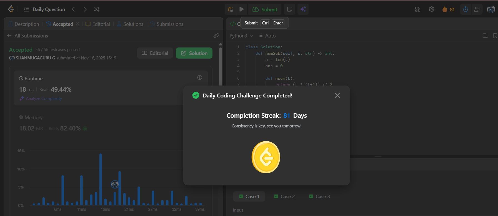

# Day 81 - Number of Substrings With Only 1s

**Problem Link**: [LeetCode 1513 - Number of Substrings With Only 1s](https://leetcode.com/problems/number-of-substrings-with-only-1s/)  
**Difficulty**: Medium

## Approach

We solve this by **finding all contiguous segments of `1`s** and counting the number of substrings within each segment using the **triangular number formula**.

### Key Insight:
> For a segment of `L` consecutive `1`s → number of valid substrings = `1 + 2 + ... + L = L*(L+1)/2`

### Steps:
1. **Skip leading `0`s** → start from first `'1'`.
2. Use two pointers:
   - `l`: start of current run of `1`s
   - `r`: end of current run
3. While `r < n`:
   - Expand `r` while `s[r] == '1'`
   - Add `nsum(r - l)` = `(L * (L+1)) // 2` to `ans`
   - Move `l` to `r`, then skip `0`s until next `'1'`
   - Set `r = l`
4. Return `ans % (10**9 + 7)` → handle overflow

> Example: `"11101"`  
> - Run: `"111"` → `L=3` → `6` substrings  
> - Run: `"1"` → `L=1` → `1` substring  
> → Total: **7**

## Complexity

- **Time**: **O(n)** — single pass
- **Space**: **O(1)**

## Screenshot
