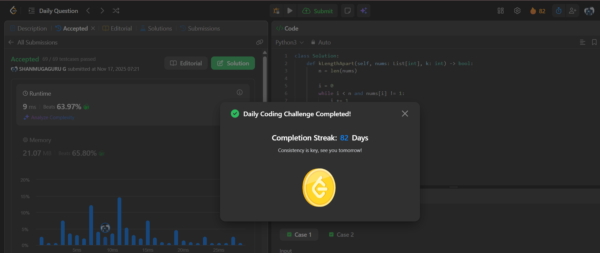

# Day 82 - Check If All 1's Are at Least Length K Places Away

**Problem Link**: [LeetCode 1437 - Check If All 1's Are at Least Length K Places Away](https://leetcode.com/problems/check-if-all-1s-are-at-least-length-k-places-away/)  
**Difficulty**: Easy

## Approach

We solve this by **iterating through the array and checking the gap between consecutive `1`s**.

### Key Insight:
> Two `1`s at indices `i` and `j` are valid if:  
> `j - i - 1 >= k` → at least `k` zeros between them.

### Steps:
1. **Find the first `1`** → set `i` to its index.
2. Start `j = i + 1`.
3. While `j < n`:
   - Move `j` to the **next `1`**.
   - If `j` is found and `j - i - 1 < k` → **return `False`**.
   - Update `i = j`, `j = i + 1`.
4. If no invalid pair found → **return `True`**.

> Skips all `0`s efficiently by jumping directly to next `1`.

### Example: `nums = [1,0,0,1,0,1]`, `k = 2`  
> - `i=0`, `j=3` → gap = `3-0-1=2 >= 2` → valid  
> - `i=3`, `j=5` → gap = `5-3-1=1 < 2` → **invalid**

## Complexity

- **Time**: **O(n)** — single pass
- **Space**: **O(1)**

## Screenshot
