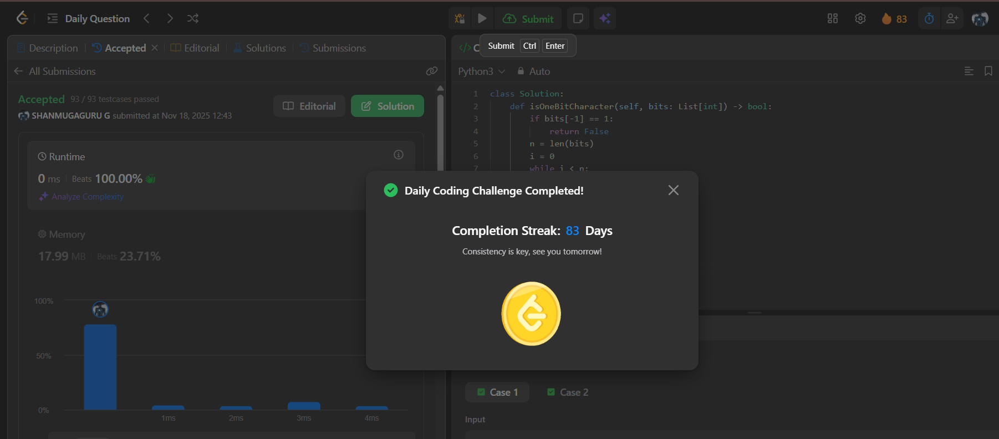

# Day 83 - 1-bit and 2-bit Characters

**Problem Link**: [LeetCode 717 - 1-bit and 2-bit Characters](https://leetcode.com/problems/1-bit-and-2-bit-characters/)  
**Difficulty**: Easy

## Approach

We solve this by **greedily parsing** the bit sequence according to the rules:
- `0` → 1-bit character
- `10` or `11` → 2-bit character

### Key Insight:
> The string is valid **if and only if** we can reach the **last character** (`bits[n-1]`) using valid steps, and the last character **must be a `0`** (1-bit character).

### Steps:
1. If `bits[-1] == 1` → impossible to end with a 1-bit character → **return `False`**.
2. Start from `i = 0`:
   - If `bits[i] == 0` → skip 1 bit (`i += 1`)
   - If `bits[i] == 1` → skip 2 bits (`i += 2`)
3. If we reach `i == n-1` and `bits[i] == 0` → **valid** → return `True`
4. Otherwise → **invalid** → return `False`

> We can also simplify: just check if we can reach the last index with valid jumps.

### Example: `bits = [1, 0, 0]`
- `i=0`: `1` → jump to `i=2`
- `i=2`: `0` → last character is `0` → **True**

### Example: `bits = [1, 1, 1, 0]`
- `i=0`: `1` → `i=2`
- `i=2`: `1` → `i=4` → out of bounds → last char not processed as 1-bit → **False**

## Complexity

- **Time**: **O(n)** — single pass
- **Space**: **O(1)**

## Screenshot
