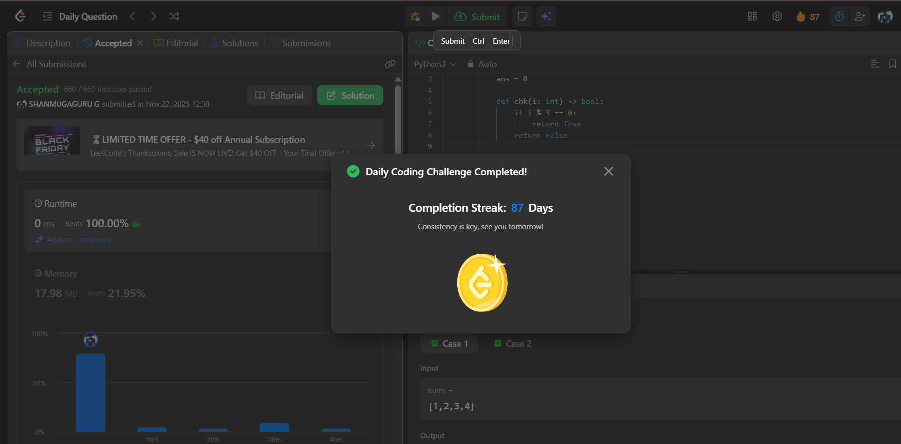

# Day 87 - Find Minimum Operations to Make All Elements Divisible by Three

**Problem Link**: [LeetCode 3190 - Find Minimum Operations to Make All Elements Divisible by Three](https://leetcode.com/problems/find-minimum-operations-to-make-all-elements-divisible-by-three/)  
**Difficulty**: Easy

## Approach

We solve this by checking for each number whether it is **already divisible by 3**, or if we can make it divisible by **changing it by at most 1**.

### Key Insight:
> A number `x` can be made divisible by 3 in **at most 1 operation** if:
> - `x % 3 == 0` → no operation needed
> - `x % 3 == 1` → subtract 1 → `x-1` is divisible by 3
> - `x % 3 == 2` → add 1 → `x+1` is divisible by 3

So, **every number** can be made divisible by 3 in **0 or 1 operation**.

### Steps:
1. For each number `i` in `nums`:
   - If `i % 3 == 0` → skip (already good)
   - Else → we need **1 operation** → increment `ans`
2. Return `ans`

> No number requires more than 1 operation.

### Example: `nums = [1, 2, 3, 4]`
- `1 % 3 = 1` → need 1 op (1→0 or 1→3)
- `2 % 3 = 2` → need 1 op (2→3)
- `3 % 3 = 0` → 0 op
- `4 % 3 = 1` → need 1 op
→ Total = **3**

## Complexity

- **Time**: **O(n)** — single pass
- **Space**: **O(1)**

## Screenshot
