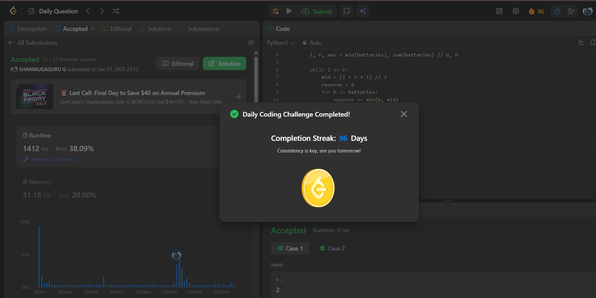

# Day 96 - Maximum Running Time of N Computers

**Problem Link**: [LeetCode 2141 - Maximum Running Time of N Computers](https://leetcode.com/problems/maximum-running-time-of-n-computers/)  
**Difficulty**: Hard

## Approach

We solve this using **Binary Search on Answer** — a powerful technique when we need to **maximize** a value under constraints.

### Key Insight:
> We want the **maximum time** `t` such that **all `n` computers** can run for **at least `t` minutes** using the given batteries.

Each battery can contribute:
- At most `t` minutes to any computer
- So total usable power = `sum(min(battery, t) for battery in batteries)`
- We need this ≥ `n * t`

### Binary Search:
- **Low**: `min(batteries)` → smallest battery limits the maximum possible time
- **High**: `sum(batteries) // n` → average power per computer
- For a candidate `mid`:
  - Compute total usable power: `sum(min(b, mid) for b in batteries)`
  - If ≥ `mid * n` → we can run for `mid` minutes → try higher
  - Else → too high → reduce

We use `(l + r + 1) // 2` to bias toward higher values.

### Example:
`n = 2`, `batteries = [3,5,10]`
- Try `mid = 6`:
  - Usable: `min(3,6)=3`, `min(5,6)=5`, `min(10,6)=6` → total = 14
  - Need: `6 * 2 = 12` → 14 ≥ 12 → possible → try higher
- Try `mid = 7`:
  - Usable: 3 + 5 + 7 = 15 ≥ 14 → still possible
- Try `mid = 8`:
  - Usable: 3 + 5 + 8 = 16 < 16 → not possible
→ Max = **7**

## Complexity

- **Time**: **O(m log S)** — `m` = number of batteries, `S` = total sum
- **Space**: **O(1)**

## Screenshot
