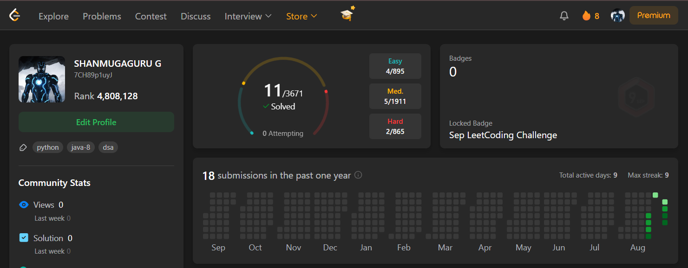

# 🚀 LeetCode Daily Challenge

Tracking my journey of solving **one LeetCode problem every day**.  
Each day has:
- ✅ Solution code
- 📸 Screenshot of submission
- 📝 Explanation (README inside each day folder)

---

## 📸 Profile at Day 7

## 📅 Progress Log  

- [Day 0 - Remove Element](DAY-0/README.md) ✅  
- [Day 1 - Merge Sorted Array](DAY-1/README.md) ✅  
- [Day 2 - Alice and Bob Playing Flower Game](DAY-2/README.md) ✅  
- [Day 3 - Valid Sudoku](DAY-3/README.md) ✅
- [Day 4 - Sudoku Solver](DAY-4/README.md) ✅  
- [Day 5 - MaxAveragePassRatio](DAY-5/README.md) ✅
- [Day 6 - Find the Number of Ways to Place People I](DAY-6/README.md) ✅
- [Day 7 - Find the Number of Ways to Place People II](DAY-7/README.md) ✅
- [Day 8 - Find Closest Person ](DAY-8/README.md) ✅
- [Day 9 - Minimum Operations to Make the Integer Zero](DAY-9/README.md) ✅
- [Day 10 - Minimum Operations to Make Array Elements Zero](DAY-10/README.md) ✅
- [Day 11 - Find N Unique Integers Sum up to Zero](DAY-11/README.md) ✅
- [Day 12 - Convert Integer to the Sum of Two No-Zero Integers](DAY-12/README.md) ✅
- [Day 13 - Number of People Aware of a Secret](DAY-13/README.md) ✅
- [Day 14 - Minimum Number of People to Teach](DAY-14/README.md) ✅
- [Day 15 - Sort Vowels in a String](DAY-15/README.md) ✅
- [Day 16 - Vowels Game in a String](DAY-16/README.md) ✅
- [Day 17 - Find Most Frequent Vowel and Consonant](DAY-17/README.md) ✅
- [Day 18 - Vowel Spellchecker](DAY-18/README.md) ✅
- [Day 19 - Maximum Number of Words You Can Type](DAY-19/README.md) ✅
- [Day 20 - Replace Non-Coprime Numbers in Array](DAY-20/README.md) ✅
- [Day 21 - Design a Food Rating System](DAY-21/README.md) ✅
- [Day 22 - Design Task Manager](DAY-22/README.md) ✅
- [Day 23 - Design Spreadsheet](DAY-23/README.md) ✅
- [Day 24 - Implement Router](DAY-24/README.md) ✅
- [Day 25 - Design Movie Rental System](DAY-25/README.md) ✅
- [Day 26 - Count Elements With Maximum Frequency](DAY-26/README.md) ✅
- [Day 27 - Compare Version Numbers](DAY-27/README.md) ✅
- [Day 28 - Fraction to Recurring Decimal](DAY-28/README.md) ✅
- [Day 29 - Triangle](DAY-29/README.md) ✅
- [Day 30 - Valid Triangle Number](DAY-30/README.md) ✅
- [Day 31 - Largest Triangle Area](DAY-31/README.md) ✅
- [Day 32 - Largest Perimeter Triangle](DAY-32/README.md) ✅
- [Day 33 - Minimum Score Triangulation of Polygon](DAY-33/README.md) ✅
- [Day 34 - Find Triangular Sum of an Array](DAY-34/README.md) ✅
- [Day 35 - Water Bottles](DAY-35/README.md) ✅
- [Day 36 - Water Bottles II](DAY-36/README.md) ✅
- [Day 37 - Trapping Rain Water II](DAY-37/README.md) ✅
- [Day 38 - Container With Most Water](DAY-38/README.md) ✅
- [Day 39 - Pacific Atlantic Water Flow](DAY-39/README.md) ✅
- [Day 40 - Swim in Rising Water](DAY-40/README.md) ✅
- [Day 41 - Avoid Flood in The City](DAY-41/README.md) ✅
- [Day 42 - Successful Pairs of Spells and Potions](DAY-42/README.md) ✅
- [Day 43 - Find the Minimum Amount of Time to Brew Potions](DAY-43/README.md) ✅
- [Day 44 - Taking Maximum Energy From the Mystic Dungeon](DAY-44/README.md) ✅
- [Day 45 - Maximum Total Damage With Spell Casting](DAY-45/README.md) ✅
- [Day 46 - Find Sum of Array Product of Magical Sequences](DAY-46/README.md) ✅
- [Day 47 - Find Resultant Array After Removing Anagrams](DAY-47/README.md) ✅
- [Day 48 - Adjacent Increasing Subarrays Detection I](DAY-48/README.md) ✅
- [Day 49 - Adjacent Increasing Subarrays Detection II](DAY-49/README.md) ✅
- [Day 50 - Smallest Missing Non-negative Integer After Operations](DAY-50/README.md) ✅
- [Day 51 - Maximize the Number of Partitions After Operations](DAY-51/README.md) ✅
- [Day 52 - Maximum Number of Distinct Elements After Operations](DAY-52/README.md) ✅